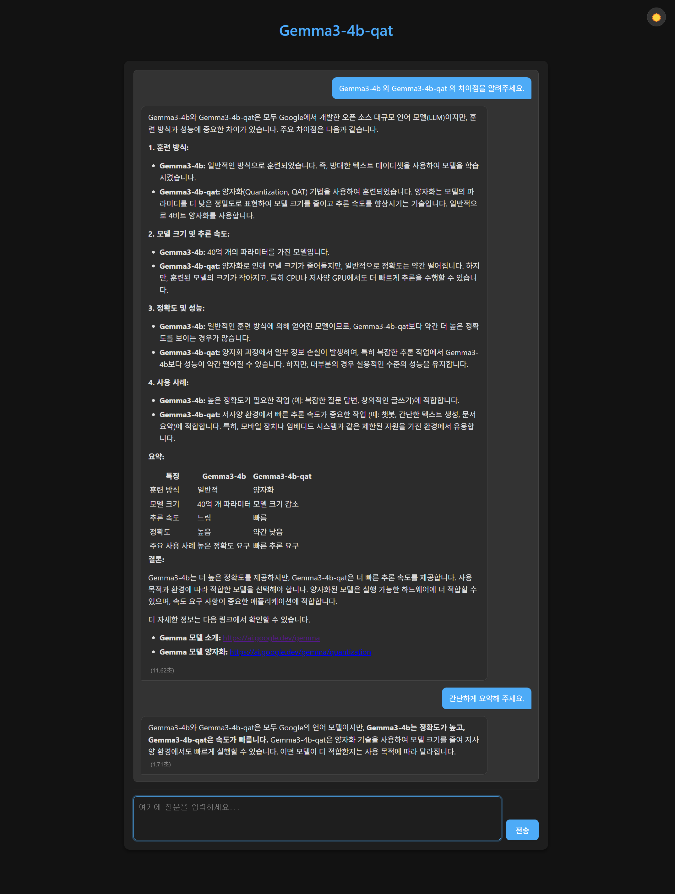

# 🌟 sLLMproject2025: 로컬 sLLM 웹 애플리케이션 🌟  
**경량화된 AI를 로컬에서 돌려봅시다.**

---

## 1.프로젝트 개요  
이 프로젝트는 **로컬에서 실행되는 초경량 대형 언어 모델(sLLM)** `gemma-3-4b-it` (양자화 버전)을 기반으로 한 **웹 애플리케이션**입니다.  
한국어를 포함한 다양한 언어로 자연어 처리를 수행하며, **직관적이고 세련된 UI**로 사용자와 AI의 소통을 한층 더 매끄럽게 만듭니다.  
로컬 환경에 최적화된 이 앱은 **GPU 가속**으로 빠르고 강력한 성능을 자랑하며, CPU만으로도 실행 가능해 접근성을 높였습니다!  

---

## 핵심 모델  
🔗 [**google/gemma-3-4b-it-qat-q4_0.gguf**](https://huggingface.co/google/gemma-3-4b-it-qat-q4_0-gguf)  
- **Google Gemma**의 Instruct 튜닝 + **4비트 양자화** 버전.
- **GGUF 형식**으로 최적화: `llama.cpp`와 `llama-cpp-python`을 통해 **CPU/GPU** 환경에서 효율적으로 동작.  
- 로컬 실행에 최적화되어 **빠르고 안정적인 성능**을 제공합니다.  

---

## 🛠️ 기술 스택  

| 🛠️ **항목**       |  **내용**                                                                 |
|--------------------|-----------------------------------------------------------------------------|
| **언어 모델**      | `google/gemma-3-4b-it` (GGUF, q4_0 양자화)                                   |
| **모델 로더**      | `llama-cpp-python` (GPU 가속 지원)                                          |
| **백엔드**         | `FastAPI` (비동기 처리로 빠르고 효율적)                                     |
| **프론트엔드**     | `HTML`, `CSS`, `JavaScript` (jQuery, Marked.js, DOMPurify로 깔끔한 UI)    |
| **실행 환경**      | Python, **GPU (CUDA) 가속** 권장, CPU 호환 가능                             |

---

## ✨주요 기능  

| **기능**           | **설명**                                         |
|------------------|------------------------------------------------|
| **다국어 지원**       | 한국어를 포함한 다양한 언어로 자연스러운 대화 가능                   |
| **웹 기반 UI**      | 채팅 로그와 입력창이 분리된 **직관적인 인터페이스**                 |
| **다크/라이트 테마**    | 눈이 편안한 테마 전환                                   |
| **Markdown 렌더링** | 깔끔하고 읽기 쉬운 응답 포맷팅                              |
| **비동기 백엔드**      | `FastAPI`로 빠르고 부드러운 서버 응답                      |
| **로컬 모델 실행**     | `llama-cpp-python`으로 GPU 가속 지원, 로컬에서 강력한 성능 발휘 |
| **대화 컨텍스트 관리**   | 대화 흐름을 유지해 자연스러운 상호작용 가능                       |
| **응답 시간 표시**     | gpu,cpu 사용 상황에 따라 응답시간을 확인 가능                  |

---

## 실행 화면 미리보기  
  
>*채팅 UI,Markdown 렌더링,맥락유지,응답시간 표시 기능을 구현했습니다.*  

---

## 🌟 왜 이 프로젝트인가?  
- **로컬 실행**으로 데이터 프라이버시 보장  
- **GPU 가속**으로 빠른 성능   
- **오픈소스 기반**으로 다양한 파라미터 커스터미이징